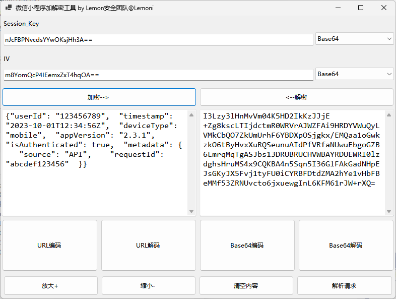
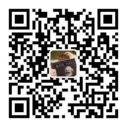

# 微信小程序加解密工具

## 项目简介
本工具由来猛安全团队开发，提供微信小程序Session Key加解密功能。支持AES加密/解密（CBC模式）、Base64/URL/Hex编码转换，也可解析JSON格式的加密请求数据。

---

## 功能特点
✅ **核心功能**  
- AES CBC加解密（支持16/24/32字节密钥）

🛠 **编码工具**  
- Base64编解码
- URL编解码
- Hex字符串转换

🔍 **智能解析**  
- 自动识别JSON中的`encryptedData`/`iv`/`sessionKey`
- 支持模糊字段匹配（如`Session_Key`/`Key`）

---

## 使用说明

### 1. 加密/解密操作
1. **输入参数**  
   - Session_Key: 填写密钥（支持Base64/Hex/UTF-8格式）
   - IV: 填写初始向量（16字节，格式同上）
2. **操作流程**  
   - 解密：在密文框粘贴数据 → 点击【解密】→ 明文显示在左侧
   - 加密：在明文框输入数据 → 点击【加密】→ 密文显示在右侧

### 2. 编码转换
- 对当前密文框内容操作：
  - URL编码/解码
  - Base64编解码
  - 自动处理UTF-8字符转换

### 3. 解析加密请求
1. 点击【解析请求】按钮
2. 粘贴JSON格式请求体（如：`{"encryptedData":"...","key":"...",iv":"..."}`）
3. 自动填充加密数据、IV和Session_Key到主界面

---

## 使用效果

---

## 开发环境
- .NET 8.0
- Visual Studio 2022

> 开发者：Lemon安全团队  
> 联系方式：
>
> 